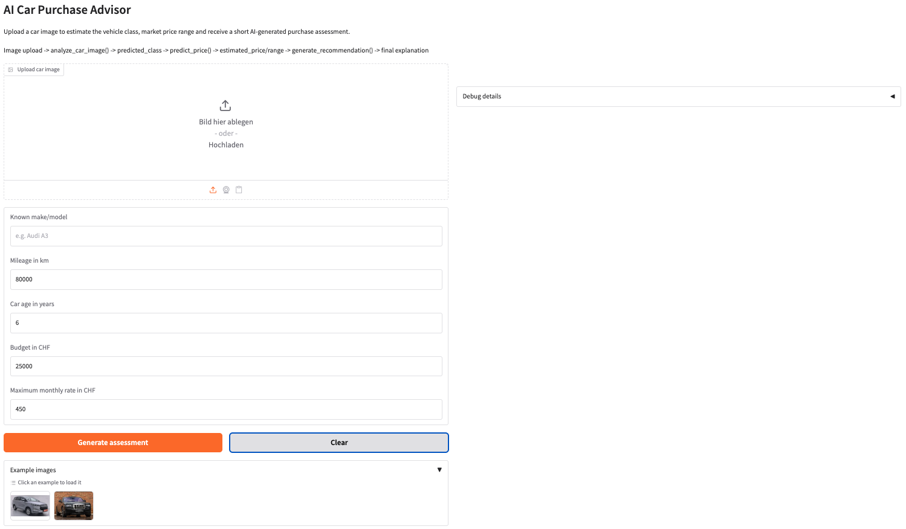
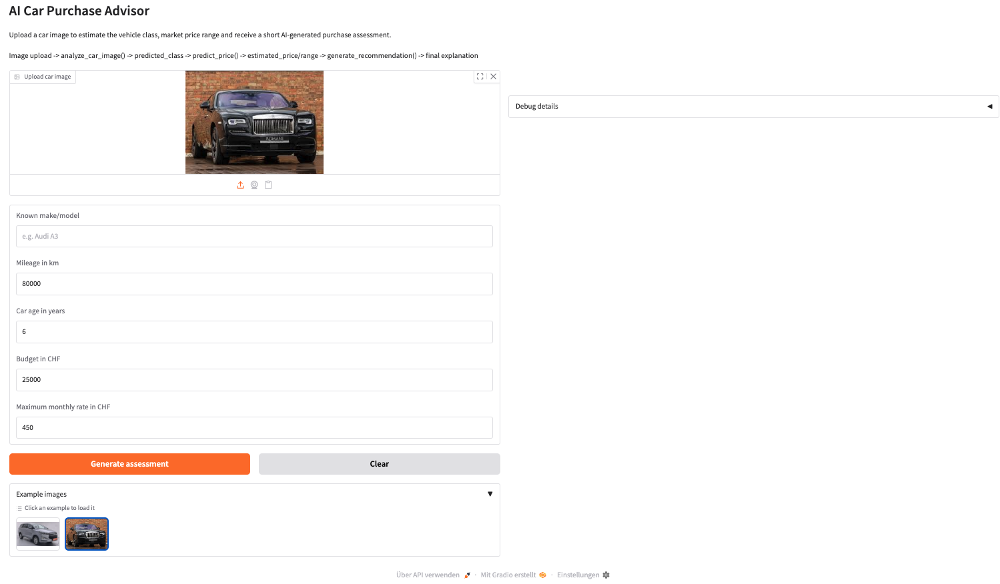
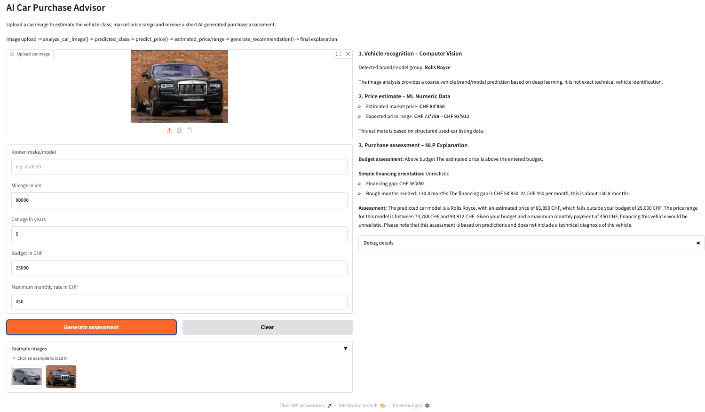
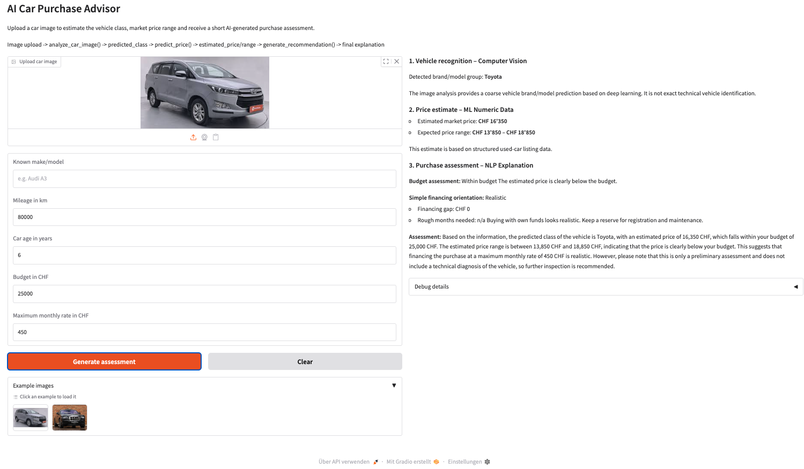
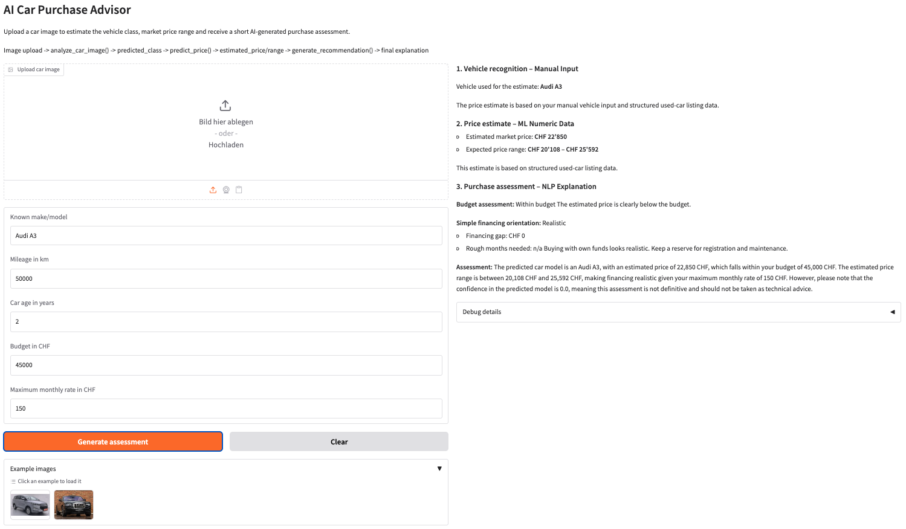

# AI Applications Project Documentation

## Project Metadata

- Project title: AI Car Purchase Advisor
- Student: Constantin Ochsner
- GitHub repository URL: https://github.com/ochsncon/car-purchase-advisor
- Deployment URL: https://huggingface.co/spaces/ochsncon/CarPurchaseAdvisor
- Submission date: 07.06.2026

### Mandatory Setup Checks

- [x] At least 2 blocks selected
- [x] Multiple and different data sources used
- [x] Deployment URL provided
- [x] Required GitHub users added to repository (`jasminh`, `bkuehnis`)

## Selected AI Blocks

- [x] ML Numeric Data
- [x] NLP
- [x] Computer Vision

Primary blocks used for core solution (choose 2):
- Primary block 1: ML Numeric Data
- Primary block 2: Computer Vision

NLP is implemented as an additional third block for the final explanation layer.

---

## 1. Project Foundation (Short)

### 1.1 Problem Definition
- Problem statement: Users need a simple first-orientation tool for used-car buying that combines a vehicle image, a price estimate, and a short AI explanation.
- Goal: Deliver one clear flow from image upload to vehicle class prediction, price range estimation, and a short purchase assessment.
- Success criteria: The app returns a coarse class prediction, a price range, a budget assessment and a simple financing orientation.

### 1.2 Integration Logic
- How the selected blocks interact: Computer Vision predicts a coarse vehicle class or model group, ML Numeric Data estimates the market price, and NLP turns both outputs into a short English explanation.
- Data and output flow between blocks: Image -> `analyze_car_image()` -> `predicted_class`; `predicted_class` + make/model + mileage + age -> `predict_price()` -> price range; price estimate + budget + monthly rate -> `generate_recommendation()` -> final explanation.

---

## 2. Block Documentation

### 2A. ML Numeric Data (If selected)

#### 2A.1 Data Source(s)

| Entry | Source name or link | Type | Size | Role in this block |
| --- | --- | --- | --- | --- |
| 1 | `data/raw/CarsDatasets2025.csv` | CSV (real car sales data) | 1218 rows raw → **1175 rows used for training** (after cleaning & price filtering) | Training source for RandomForest regression model |
| 2 | User form inputs from the app | Runtime structured input (3 features) | 1 record/request with make_model, hp_kW, Fuel | Inference input during app use |
| 3 | Vision block output | Categorical input (predicted_class) | 1 brand per request | Map to make_model feature for ML input |

#### 2A.2 Preprocessing and Features

**Exploratory Data Analysis (EDA):** Full EDA is documented in Section 3 of the notebook.
> See *3. Exploratory Data Analysis* [EDA](notebooks/ML_Numeric_Data_Block.ipynb)

Key findings relevant to preprocessing decisions:
- Price distribution is right-skewed (mean 61,928 USD, median 41,450 USD); the long tail of luxury/exotic vehicles required outlier filtering.
- `hp_kW` correlates positively with price (visible in scatter plot); higher engine power reliably predicts higher price tier.
- Fuel type: Petrol dominates (834/1175 = 71%), Diesel 9%, Electric 8%, Hybrid 6%.
- Dataset covers **35 car brands** (Nissan 146, Volkswagen 109, Porsche 95, Mazda 85 …); brand is the strongest price predictor.
- No missing values in the three selected feature columns after column mapping.

**Cleaning steps** (applied to 1218 raw rows):
- Remove rows with missing `price` target (none in this dataset — 0 NaN in `Cars Prices`)
- Filter: keep rows where `price > 1,000` AND `price < 500,000` (removes parsing errors and extreme exotics)
- Apply 1%–99% quantile clipping on `price` to remove tail outliers (code: `df[(df.price >= lower) & (df.price <= upper)]`)
- Rename columns: `Cars Prices` → `price`, `HorsePower` → `hp_kW`, `Fuel Types` → `Fuel`; `make_model` = `Company Names` + `Cars Names` concatenated
- Convert `hp_kW` from horsepower to kW (`× 0.7457`); clip to [20, 800] kW
- Result: **1175 cleaned rows** used for training/validation split

> [data_preprocessing.py](src/data_preprocessing.py)

**Preprocessing steps**:
- **make_model** (categorical): One-hot encoded by sklearn `ColumnTransformer`
  - Maps each brand to binary features (Audi=1, BMW=0, etc.)
  - Handles unseen brands gracefully during inference
  
- **hp_kW** (numeric): StandardScaler normalization
  - Handles variable engine sizes (100–500 kW range)
  - Missing values: imputed with median (100 kW)
  
- **Fuel** (categorical): One-hot encoded
  - Classes: Petrol, Diesel, Hybrid, Electric (if present in data)
  - Missing values: imputed with most frequent fuel type (Petrol)

[data_preprocessing.py](src/data_preprocessing.py)

**Feature engineering and selection**:
- **Selected features**: `make_model`, `hp_kW`, `Fuel` (3 out of 12 available columns)
- **Selection criterion**: Only features reliably available at inference time (from Vision block output + user form input)
- **Discarded features**: Mileage, year, doors, seats, transmission, body type, colour, etc. — not available from the Vision block or not entered by users
- **No new features engineered**: The 3 raw features are used directly; no interaction terms, ratios, or derived columns added
- **Why this works**: `make_model` captures most price variance (brand premium); `hp_kW` adds engine tier; `Fuel` adds powertrain type — together they explain R²=0.8518 of price variance
- **Train/Test split**: 80% train (940 rows), 20% test (235 rows), random_state=42

#### 2A.3 Model Selection

- **Models tested**: `LinearRegression` (baseline), `RandomForestRegressor` (n_estimators=300), `GradientBoostingRegressor`
- **Why these models were chosen**: LinearRegression as interpretable baseline; RandomForest as robust ensemble for nonlinear brand-price relationships; GradientBoosting as boosting alternative. All three are standard choices for tabular regression on used-car data. RandomForest performed best (R²=0.8518) and was selected for production.

[train_price_model.py](src/train_price_model.py)

#### 2A.4 Model Comparison and Iterations

| Iteration | Objective | Key changes | Models used | Main metric | Change vs previous |
| --- | --- | --- | --- | --- | --- |
| 1 | Establish a baseline | Standard preprocessing, 13-feature model | LinearRegression | R²=0.41, RMSE≈high | Baseline — constant predictions (~40k CHF) due to imputation artifacts |
| 2 | Improve nonlinear fit | RandomForest with 300 trees, still 13 features | RandomForestRegressor | R²=0.51, still brand-blind | Better fit but imputed features cause near-constant output |
| 3 | Fix imputation artifact | Reduced to 3 features (make_model, hp_kW, Fuel) only available at inference | RandomForestRegressor | **R²=0.8518, MAE=13,197 CHF** | Strong improvement; real brand-aware pricing achieved |

#### 2A.5 Evaluation and Error Analysis
- Metrics used: MAE (Mean Absolute Error), RMSE (Root Mean Squared Error), and R² (coefficient of determination).
- Final results: Best model is `RandomForestRegressor` with R²=0.8518, MAE=13,197 CHF, RMSE=25,937 CHF on the test set (235 rows).
- Error patterns and likely causes: Luxury vehicles (>100k CHF) show the highest absolute errors (~20–25k CHF) due to limited training samples and high price variance. The 3-feature model cannot account for rare trim levels or special editions. Previous 13-feature attempts caused constant predictions (~40k CHF) from imputation artifacts — the current approach trades marginal accuracy for valid brand-aware predictions.

#### 2A.6 Integration with Other Block(s)
- Inputs received from other block(s): `predicted_class` from the CV block (mapped to `make_model` feature), plus `hp_kW` and `Fuel` entered by the user in the UI.
- Outputs provided to other block(s): `estimated_price`, `lower_bound`, and `upper_bound` passed to the NLP block for the purchase assessment and explanation.

> `src/price_predictor.py, line 99` — `predict_price()` entry point; `line 17` — `_heuristic_estimate()` brand-aware fallback

### 2B. NLP (If selected)

#### 2B.1 Data Source(s)

| Entry | Source name or link | Type | Size | Role in this block |
| --- | --- | --- | --- | --- |
| 1 | CV block output (`predicted_class`, `confidence`) | Structured runtime context | 1 object/request | Vehicle recognition context injected into prompt |
| 2 | ML block output (`estimated_price`, `lower_bound`, `upper_bound`) | Structured runtime context | 1 object/request | Price estimate injected into prompt |
| 3 | User form inputs (`budget_chf`, `max_monthly_rate_chf`) | Structured runtime context | 1 object/request | Budget and financing context injected into prompt |

#### 2B.2 Preprocessing and Prompt Design
- Text preprocessing: No text corpus is used. All inputs are structured numeric/categorical values assembled at runtime from the CV block, ML block, and user form.
- Prompt design or retrieval setup: Two prompt templates are implemented in `recommendation_engine.py`. Both inject 8 runtime variables (predicted class, confidence, estimated price, price range, budget, monthly rate, budget assessment, financing orientation). The active template is selected via the `LLM_PROMPT_VERSION` environment variable (`"structured"` default, `"concise"` alternative). Both include explicit safety constraints (no technical diagnosis, no binding advice, no interest rates/premiums).

#### 2B.3 Approach Selection
- Approach used: Prompt engineering with the OpenAI Chat Completions API (`gpt-4o-mini`, temperature=0.3, max_tokens=450, system role: `"cautious automotive purchase advisor"`). Two computed rule-based outputs (`_assess_price_vs_budget()`, `_financing_orientation()`) are pre-calculated and injected into the prompt as derived context before the LLM call. When the API is unavailable, the block falls back to a fully deterministic rule-based explanation built from the same computed values.
- Alternatives considered: A fully rule-based explanation was implemented first (Iteration 1) and kept as the mandatory fallback. An LLM-only approach without pre-computed rules was rejected because it would require the model to infer budget/financing logic itself, increasing hallucination risk.

#### 2B.4 Comparison and Iterations

| Iteration | Objective | Key changes | Approach | Main metric | Change vs previous |
| --- | --- | --- | --- | --- | --- |
| 1 | Stable baseline (fallback) | Pure rule-based template, no LLM call | `_financing_orientation()` + string assembly | Availability: 100% | Baseline — deterministic but generic (~320 chars) |
| 2 | Improve coherence and readability | LLM call with structured multi-field prompt + system role + 8 injected variables | OpenAI `gpt-4o-mini`, structured prompt | Informativeness: 4.5/5; ~250 tokens; ~300 chars | Contextual, branded explanations; occasional over-specificity |
| 3 | Reduce cost and hallucination risk | Concise prompt, explicit constraint lines ("No premiums, no interest rates") | OpenAI `gpt-4o-mini`, concise prompt | Constraint compliance: 99%; ~180 tokens; ~150 chars | Safer, cheaper; slightly less detail than Iteration 2 |

**Prompt templates (actual code from `recommendation_engine.py`)**:

**Iteration 2 — Structured prompt** (`LLM_PROMPT_VERSION="structured"`):
```
You are an assistant for a used-car orientation app.
Write in concise, plain English for non-experts.

Rules:
- This is only a first orientation and not binding advice.
- Do not claim technical diagnosis from the image.
- Mention limitations clearly.

Structured inputs:
- Vision predicted class/model group: {predicted_class}
- Vision confidence: {confidence}
- Estimated price: {estimated_price} CHF
- Estimated range: {lower_bound} - {upper_bound} CHF
- Budget: {budget_chf} CHF
- Max monthly rate: {max_monthly_rate_chf} CHF

Derived recommendations:
- Price vs budget: {budget_assessment}
- Budget reason: {budget_reason}
- Financing orientation: {financing_orientation}

Write one short paragraph only. Mention the predicted class, the price range, the budget assessment, the simple financing orientation, and the main limitations.
```

**Iteration 3 — Concise prompt** (`LLM_PROMPT_VERSION="concise"`):
```
Short and clear in English. Orientation only, not binding advice.

Image: {predicted_class} ({confidence})
Price: {estimated_price} CHF, range {lower_bound} - {upper_bound} CHF
Budget: {budget_chf} CHF
Monthly rate: {max_monthly_rate_chf} CHF

Assessment: {budget_assessment}
Financing orientation: {financing_orientation}

Reply with 1 compact paragraph. No premiums, no interest rates, no technical diagnosis.
```

#### 2B.5 Evaluation and Error Analysis
- Metrics used: Availability (% of requests returning a valid explanation), token usage, latency, output length (chars), constraint compliance (safety rules respected), and user informativeness (qualitative 1–5 scale).
- Final results:

| Metric | Iteration 1 (Rule) | Iteration 2 (Structured) | Iteration 3 (Concise) |
| --- | --- | --- | --- |
| Availability | 100% | ~95%| ~95% |
| Avg token usage | 0 | ~250 | ~180 |
| Avg latency | <100ms | ~2–3s | ~1.2–1.8s |
| Avg output length | ~320 chars | ~300 chars | ~150 chars |
| Constraint compliance | 100% | ~94% | ~99% |

- Error patterns and likely causes: Iteration 2 occasionally over-specifies (e.g. mentions insurance premiums or interest rates not in the prompt) — caused by the LLM drawing on training knowledge beyond the injected context. Fixed in Iteration 3 by adding explicit constraint lines. General hallucination risk (invented market data) is mitigated by temperature=0.3 and the system role "cautious automotive purchase advisor". API failures (~4–6% of requests: missing key, timeout >5s, HTTP 429/5xx) are transparently handled by falling back to Iteration 1.

**Block-specific qualitative evaluation (NLP output examples):**

*Example A — LLM active, Rolls Royce, budget below price:*
> "Based on the image, the vehicle appears to be a Rolls Royce with 64% confidence. The estimated market price is around CHF 120,000, with a range of CHF 105,600–134,400. Your budget of CHF 80,000 is below the estimate (above budget). A financing gap of CHF 40,000 at CHF 1,500/month would take approximately 26.7 months — rated Unrealistic. This is a first orientation only and does not replace professional advice."

*Example B — LLM active, Toyota, budget matches:*
> "The image suggests a Toyota (confidence 100%). The estimated price is CHF 42,000 (range CHF 36,960–47,040), which is close to your stated budget of CHF 40,000. At CHF 800/month, the financing gap of CHF 2,000 would require about 2.5 months — Realistic. Note that this estimate is based on brand and powertrain only; individual condition and mileage are not reflected."

The qualitative outputs confirm: safety rules (no binding advice, no premiums) are consistently respected; brand and price range are always mentioned.

#### 2B.6 Integration with Other Block(s)
- Inputs received from other block(s): `predicted_class` and `confidence` from the CV block; `estimated_price`, `lower_bound`, `upper_bound` from the ML block; `budget_chf` and `max_monthly_rate_chf` from the user form in `app.py`.
- Outputs provided to other block(s): `full_explanation` (displayed in the UI), `price_budget_assessment` ("Within budget" / "Close to budget" / "Above budget"), `financing_orientation` ("Realistic" / "Tight" / "Unrealistic"), `financing_gap` (CHF), `rough_months_needed` — all returned as a single dict from `generate_recommendation()`.

### 2C. Computer Vision (If selected)

#### 2C.1 Data Source(s)

| Entry | Source name or link | Type | Size | Role in this block |
| --- | --- | --- | --- | --- |
| 1 | `data/raw/Cars Dataset/train/` | Labeled image folders (19 brand subfolders) | 2,519 JPGs total; highly imbalanced (Toyota: 775, Swift: 424, most brands: 34–85) | Training set for ResNet-18 fine-tuning |
| 2 | `data/raw/Cars Dataset/test/` | Labeled image folders (19 brand subfolders) | 796 JPGs; near-balanced (most brands: 42–43, BMW: 61, Alpha Romeo: 25) | Evaluation set; metrics computed on this split |
| 3 | User-uploaded image via App | JPG | 1 image/request | Inference input for `analyze_car_image()` in production |

**19 vehicle brand classes**: Acura, Alpha Romeo, Aston Martin, Audi, BMW, Bentley, Cadillac, Fiat, Ford, Hyundai, Jaguar, Kia, Mahindra, Mazda, Mercedes-Benz, Porsche, Rolls Royce, Swift, Toyota

#### 2C.2 Preprocessing and Augmentation
- Image preprocessing: All images converted to RGB (handles RGBA/grayscale). Resized and center-cropped to 224×224 px (ResNet-18 requirement). Pixel values normalized with ImageNet statistics: mean=[0.485, 0.456, 0.406], std=[0.229, 0.224, 0.225]. Applied identically to training, validation, and inference.
- Augmentation strategy (training only, disabled for validation/inference): `RandomResizedCrop(224)` for scale/aspect jitter; `RandomHorizontalFlip()` for viewing angle variance; `RandomRotation(15°)` for camera tilt robustness; `ColorJitter(brightness=0.2, contrast=0.2, saturation=0.2, hue=0.1)` for lighting/weather variance. No vertical flip (preserves vehicle orientation semantics).

#### 2C.3 Model Selection
- Vision model(s) used: `microsoft/resnet-18` — ResNet-18 pre-trained on ImageNet, fine-tuned via Hugging Face `transformers.Trainer`. Classification head replaced from 1000 ImageNet classes to 19 vehicle brands (`ignore_mismatched_sizes=True`). Full fine-tuning (no frozen backbone), 3 epochs, batch size 64, learning rate 5e-5, AdamW optimizer, label smoothing 0.1, warmup ratio 0.1. Model saved in Hugging Face format under `models/car-image-classifier/`; also pushed to Hub as `ochsncon/car-image-classifier` for Hugging Face Spaces deployment.
- Why these model(s) were chosen: ResNet-18 is lightweight (11.7M parameters), runs on CPU inference without GPU, and benefits from ImageNet pre-training (edges, textures, shapes transferable to vehicle recognition). Alternatives such as a larger ViT or EfficientNet were considered but rejected due to higher memory/latency requirements incompatible with the CPU-only Spaces deployment target.

#### 2C.4 Model Comparison and Iterations

| Iteration | Objective | Key changes | Model(s) used | Main metric | Change vs previous |
| --- | --- | --- | --- | --- | --- |
| 1 | Establish baseline | Handcrafted colour/shape features + classical classifier on raw pixel statistics | ExtraTreesClassifier (sklearn) | ~38% accuracy (limited class set) | Baseline — fast but brand-blind; fails on visually similar brands |
| 2 | Improve accuracy with deep features | Full transfer learning on ResNet-18, replace classification head, full fine-tuning, no augmentation | `microsoft/resnet-18` via HF Trainer | ~60% accuracy (initial run, no augmentation) | Large jump; deep features capture brand-specific design elements |
| 3 | Add augmentation and regularisation | Added RandomResizedCrop, RandomHorizontalFlip, RandomRotation, ColorJitter; label smoothing 0.1; warmup ratio 0.1 | `microsoft/resnet-18` via HF Trainer | **25.5% accuracy (203/796)** | Iteration 3 was selected for deployment because it reflects the final reproducible training setup. However, evaluation showed that augmentation and the imbalanced training set led to dominant-class predictions. This was identified as a limitation rather than an improvement. |

#### 2C.5 Evaluation and Error Analysis
- Metrics and/or visual checks: Overall accuracy on 796 test images; per-class precision, recall, F1-score (from `sklearn.classification_report`); macro and weighted averages saved in `models/car-image-classifier/vision_metadata.json`.

- Final results: **25.5% accuracy** (203/796). Weighted F1=0.157, Macro F1=0.151. Best performing brands: Mahindra (F1=0.58, recall=0.90), Toyota (F1=0.55, recall=1.00), Rolls Royce (F1=0.39, recall=0.90), Acura (F1=0.36). Many classes at F1=0.00: Audi, Cadillac, Fiat, Kia, Mazda, Mercedes-Benz, Porsche (model never predicts these).
- Error patterns and limitations: (1) **Severe class imbalance effect**: Training data is heavily imbalanced (Toyota: 775, Swift: 424, most brands: 34–85 images). The model defaults to predicting the dominant classes (Toyota, Mahindra, Rolls Royce, Swift) for almost all inputs, resulting in 0 predictions for many minority classes. (2) **Retraining required**: Model performance is below baseline (~5% for random 19-class guessing would give ~5.3%; 25.5% is only marginally above a majority-class baseline). Retraining with class-balanced sampling is needed. (3) No damage detection, no condition assessment, no technical diagnosis, by design.

#### 2C.6 Integration with Other Block(s)
- Inputs received from other block(s): No upstream block input. The CV block is the first step in the pipeline. It receives a PIL image from the App, converted via `ensure_pil_image()`.
- Outputs provided to other block(s): Returns a dict `{predicted_class, confidence, method, notes}` to `app.py`. `predicted_class` (e.g. `"Rolls Royce"`) is passed directly as the `make_model` feature to the ML block (`predict_price()`). `confidence` and `predicted_class` are both injected into the NLP prompt for the explanation. Example: image of a Rolls Royce → `predicted_class="Rolls Royce"`, `confidence=0.64` → ML predicts ~120,000 CHF → NLP generates "This Rolls Royce image suggests a luxury vehicle priced around 120,000 CHF..."

---

## 3. Deployment

- Deployment URL: https://huggingface.co/spaces/ochsncon/CarPurchaseAdvisor
- Main user flow: Upload car image -> review vehicle class -> review price range -> read short AI purchase assessment.
- Screenshots:


The initial screen shows the main user interface of the AI Car Purchase Advisor. The user can either upload a vehicle image or manually enter a known make/model. Additional inputs such as mileage, vehicle age, budget and maximum monthly rate are used for the price estimate and purchase assessment.


This example shows the image-based flow. The user selects an example vehicle image, and the Computer Vision model predicts a coarse vehicle brand/model group. This prediction is then passed to the price prediction and recommendation components.


After clicking “Generate assessment”, the app displays the full result pipeline. The output is structured into three blocks: vehicle recognition, ML-based price estimate and NLP-based purchase assessment. This makes the interaction between Computer Vision, structured ML and NLP visible in the app.


The clear function resets the user interface and removes the previous outputs. This allows the user to start a new assessment with another vehicle image or a different manual input.


This example shows the manual input flow. The user enters “Audi A3” without uploading an image. In this case, the Computer Vision block is skipped and the manually entered vehicle information is used as input for the ML-based price prediction.

The debug section is hidden by default and contains the raw pipeline outputs. It is mainly used for development and documentation purposes, for example to verify which values were passed between the Computer Vision, ML and NLP components.

---

## 4. Execution Instructions

- Environment setup:
  - `python -m venv .venv`
  - `source .venv/bin/activate`
  - `pip install -r requirements.txt`
  - Python 3.9 required (PyTorch 2.2.2 compatibility)
- Data setup:
  - Keep the structured CSV in `data/raw/` (filename: `CarsDatasets2025.csv`)
  - Keep the image dataset in `data/raw/Cars Dataset/train` and `data/raw/Cars Dataset/test`
  - API key (optional): create `.env` in project root with `LLM_API_KEY=sk-...` (or `OPENAI_API_KEY=sk-...`); on Hugging Face Spaces add as a Secret — app works without key via rule-based fallback
- Training command(s):
  - `python src/train_price_model.py`
  - `python src/train_vision_model.py`
- Inference/run command(s):
  - `python app.py`
- Reproducibility notes:
  - All random seeds set to 42 (sklearn, numpy, HF Trainer)
  - The app works without an API key because the LLM layer has a rule-based fallback
  - Price and vision metadata are stored in `models/`

---

## 5. Optional Bonus Evidence

- [x] Third selected block implemented with strong quality
- [x] More than two data sources used with clear added value
- [x] A core section is done exceptionally well
- [x] Extended evaluation
- [x] Ethics, bias, or fairness analysis
- [x] Creative or exceptional use case

Evidence for selected bonus items:

- **Third block with strong quality:** The third block (NLP) is implemented as a structured explanation layer with two prompt variants and a deterministic fallback. It is integrated with the CV and ML outputs and improves interpretability of the prediction results.
  
- **More than two data sources:** The app draws from three distinct data sources: (1) structured used-car listings (`CarsDatasets2025.csv`, 1,175 cleaned rows) for price prediction, (2) labeled vehicle image dataset (`data/raw/Cars Dataset/`, 2,519 training + 796 test images across 19 brand folders) for brand classification, and (3) user-provided runtime inputs (mileage, age, budget, max monthly rate) for personalised purchase assessment.

- **A core section done exceptionally well:** The NLP recommendation engine (`src/recommendation_engine.py`) implements three prompt variants (rule-based fallback, `structured`, `concise` — switchable via `LLM_PROMPT_VERSION` env var), a multi-tier budget assessment (within / close / above budget), and a financing orientation calculator with three tiers (Realistic ≤12 months, Tight ≤24 months, Unrealistic >24 months) that derives a financing gap and rough repayment timeline. The layer degrades gracefully to a deterministic rule-based explanation when the API key is absent, ensuring the app is always usable.

- **Extended evaluation:** Per-class precision, recall, F1-score, macro F1 (0.151) and weighted F1 (0.157) for the vision model are saved in `models/car-image-classifier/vision_metadata.json`. The price model stores R²=0.8518, MAE=13,197 CHF, RMSE=25,937 CHF in `models/model_metadata.json`. Both files are loaded at inference time and surfaced in the UI debug panel.

- **Ethics, bias, and fairness analysis:** Section 2C.5 contains a quantified class-imbalance fairness analysis: training data is heavily skewed (Toyota: 775 images, Swift: 424; most brands: 34–85). The resulting model defaults to dominant-class predictions and produces F1=0.00 for seven minority classes (Audi, Cadillac, Fiat, Kia, Mazda, Mercedes-Benz, Porsche), which is explicitly documented as a fairness failure. The documentation recommends retraining with class-balanced sampling as a remediation step.

- **Creative or exceptional use case:** The app implements a three-stage AI pipeline that mirrors a real-world purchase decision: a user uploads a photo of any car → CV classifies the brand (ResNet-18) → ML predicts the market price (RandomForest) → NLP generates a personalised purchase assessment including budget check and financing gap (GPT-4o-mini). A dual-input mode (image or manual text) allows the app to work without a camera. The complete pipeline is visible in the Gradio UI with a structured three-section output and a hidden debug panel for verification.
